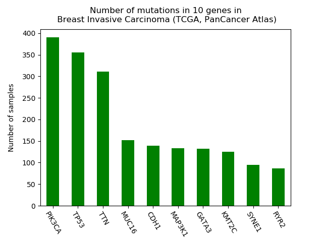

# What mutations in breast cancer are important for survival?

This project will investigate TCGA open data on breast cancer, in order to determine what mutated genes contribute to survival probablility in breast cancer patients. Further of interest, is identifying the clonal origin of these mutations (ie. late or early in cancer evolution).

## Data

Open access data is obtained via the [cBio portal](https://docs.cbioportal.org/6.-web-api-and-clients/api-and-api-clients) from the BRCA cohort of the [TCGA pan-cancer atlas](https://www.cell.com/pb-assets/consortium/pancanceratlas/pancani3/index.html) project 

## Sample plot

## References

1. Cho, H.-J., Lee, S., Ji, Y. G. & Lee, D. H. Association of specific gene mutations derived from machine learning with survival in lung adenocarcinoma. PLoS One 13, (2018).

